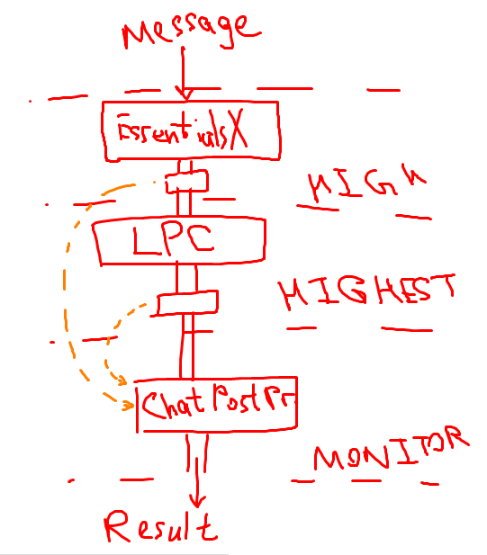

# Chat Post Processor

Use AsyncChatEvent for chat processing

## How it works



# Use cases

## [LPC](https://www.spigotmc.org/resources/lpc-chat-formatter.68965/) + [EssentialsX Chat](https://essentialsx.net/wiki/Module-Breakdown.html#essentialsx-chat)

LPC will not show you any prefix (so, you cannot determine is the chat message global- or local-scoped).

You can use this plugin to create prefixes for global and local chat.

Ready-to-use config:

```yml
post-result: '{chat-global}{chat-local} {old-format}'

by-priority:
  HIGH:
    - pattern: '[L]'
      replace-by: '(Local Chat)'
      key: 'chat-local'
    - pattern: '[Shout]'
      replace-by: '(Global Chat)'
      key: 'chat-global'
```